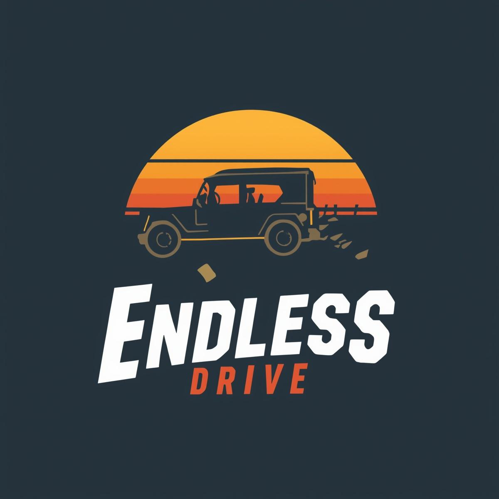
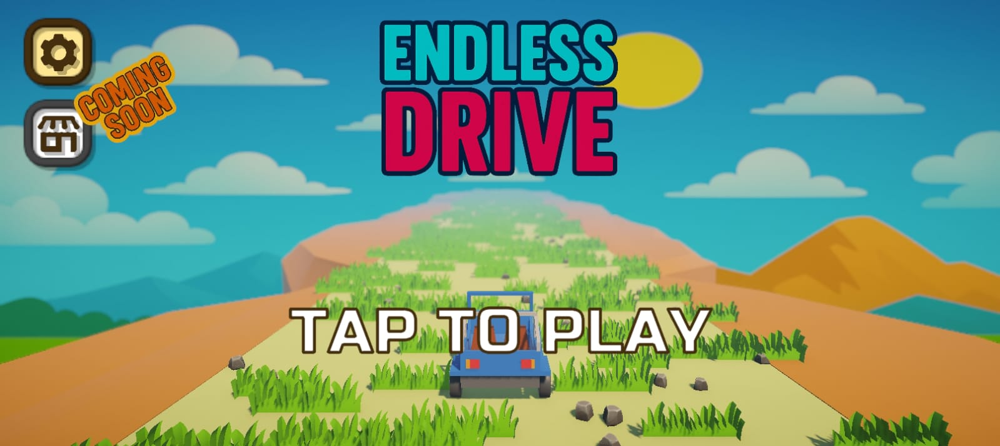
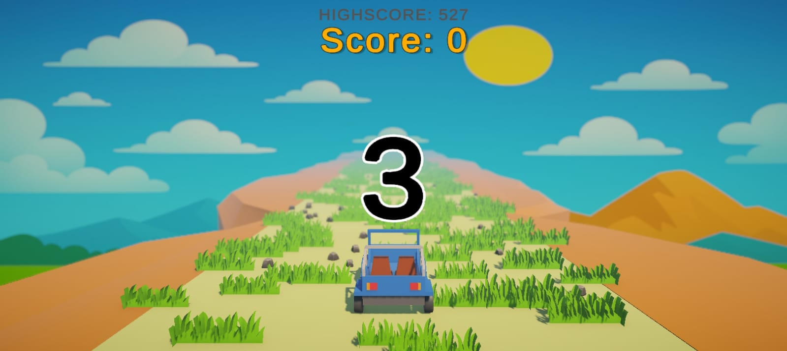

<div align="center">


<h1>   Endless Drive</h1>

### *How far can you go?*

[](https://unity.com/)
[](https://www.android.com/)
[]()
[]()
[]()

<a href="https://gds-gamedev.itch.io/endless-drive">
  
</a>


<p align="center">
  <a href="#-about">About</a> •
  <a href="#-gameplay">Gameplay</a> •
  <a href="#-features">Features</a> •
  <a href="#-controls">Controls</a> •
  <a href="#-screenshots">Screenshots</a> •
  <a href="#%EF%B8%8F-technology-stack">Tech Stack</a> •
  <a href="#-development">Development</a> •
  <a href="#-roadmap">Roadmap</a>
</p>

</div>

---

## 📖 About

**Endless Drive** is a fast-paced, low-poly endless runner that puts you behind the wheel of a rugged jeep navigating an infinite dirt path filled with obstacles. Test your reflexes as the game progressively increases in difficulty, challenging you to beat your high score with every run.

Perfect for both quick gaming sessions and extended survival attempts, Endless Drive combines simple mechanics with addictive gameplay that keeps you coming back for more.

<div align="center">

### 🎯 **Key Objective**: Dodge obstacles and survive as long as possible!

</div>

---

## 🎮 Gameplay

Navigate your jeep through a procedurally generated terrain filled with dynamic hazards including:

- 🪨 **Rocks** - Scattered boulders that test your reaction time
- 🌲 **Trees** - Forest obstacles requiring precise maneuvering
- ⚡ **Increasing Speed** - Progressive difficulty that ramps up the challenge

As you progress, the speed intensifies, demanding sharper reflexes and better anticipation. Every run is different thanks to procedural generation, ensuring fresh challenges each time you play.

### 🏆 Scoring System
- Distance traveled = Points earned
- Longer survival = Higher scores
- Challenge yourself and beat your personal best!

---

## ✨ Features

<table>
<tr>
<td width="50%">

### 🛣️ **Infinite Terrain**
Procedurally generated endless path ensures no two runs are identical

### 📈 **Dynamic Difficulty**
Game speed increases progressively, keeping you on edge

### 🎨 **Low-Poly Aesthetics**
Stylized visual design that's both beautiful and performant

</td>
<td width="50%">

### ⚡ **Optimized Performance**
Lightweight architecture runs smoothly on low-end devices

### 🏅 **High Score Tracking**
Persistent leaderboard to track your personal best

### 📱 **Cross-Platform**
Seamless experience on both mobile and desktop

</td>
</tr>
</table>

---

## 🎯 Controls

<div align="center">

### Mobile 📱
**TAP** anywhere on the screen to steer your vehicle

---

*Intentionally minimal controls for maximum accessibility and quick learning*

</div>

---

## 📸 Screenshots

<div align="center">



<br><br>



</div>

---

## 🛠️ Technology Stack

<table>
<tr>
<td align="center" width="25%">
<br>
<b>Unity Engine</b><br>
<sub>Core Development Platform</sub>
</td>
<td align="center" width="25%">
<br>
<b>C#</b><br>
<sub>Gameplay Logic & Systems</sub>
</td>
<td align="center" width="25%">
<br>
<b>Blender</b><br>
<sub>3D Asset Creation</sub>
</td>
<td align="center" width="25%">
<br>
<b>Physics</b><br>
<sub>Collision & Movement</sub>
</td>
</tr>
</table>

### Technical Implementation
- **Unity Terrain System** for procedural landscape generation
- **Physics-based vehicle controller** for realistic handling
- **Object pooling** for efficient obstacle management
- **Mobile-optimized rendering** with LOD (Level of Detail) systems

---

## 💡 Design Philosophy

**Endless Drive** was crafted with a clear vision in mind:

```
Simplicity + Engagement = Addictive Gameplay
```

### Core Principles

🎯 **Accessible to All**  
Simple mechanics that anyone can pick up in seconds, yet challenging enough to master over time

⚙️ **Performance First**  
Optimized for smooth gameplay even on low-end mobile devices

🎨 **Visual Appeal**  
Minimalistic low-poly aesthetic that prioritizes clarity and performance

🔄 **Infinite Replayability**  
Procedural generation and score chasing create endless motivation to improve

---

## 🚀 Development Highlights

### Technical Achievements

- ✅ **Procedural Obstacle System** - Dynamic spawning algorithm ensures varied gameplay patterns
- ✅ **Adaptive Difficulty Scaling** - Smooth speed progression that maintains challenge without frustration  
- ✅ **Responsive Vehicle Physics** - Fine-tuned handling that balances accessibility with skill expression
- ✅ **Mobile Optimization** - Careful lighting and model optimization for 60 FPS on budget devices
- ✅ **Memory Management** - Object pooling and efficient asset loading for minimal memory footprint

### Development Timeline

```
🎨 Concept & Planning → 🏗️ Core Mechanics → 🎮 Gameplay Tuning → 🚀 Launch
     Week 1-2              Week 3-4            Week 5-6         Week 7
```

---

## 🗺️ Roadmap

### 🔜 Planned Features

- [ ] **Power-ups System** - Shields, speed boosts, and temporary invincibility
- [ ] **Multiple Vehicles** - Unlock new jeeps with different handling characteristics
- [ ] **Day/Night Cycle** - Dynamic lighting and atmospheric changes
- [ ] **Weather Effects** - Rain, fog, and sandstorms for added challenge
- [ ] **Global Leaderboards** - Compete with players worldwide
- [ ] **Achievement System** - Unlock badges for special accomplishments
- [ ] **Sound & Music** - Immersive audio experience with engine sounds and soundtrack

### 💭 Future Considerations

- Multiplayer ghost racing mode
- Customization options for vehicles
- Alternative terrain biomes (desert, snow, urban)

> **Want to see a feature?** Open an issue or leave feedback on [Itch.io](https://gds-gamedev.itch.io/endless-drive)!

---

## 📊 Project Stats

<div align="center">

| Metric | Value |
|--------|-------|
| **Development Time** | 7 weeks |
| **Lines of Code** | ~2,500 |
| **3D Assets** | 15+ unique models |
| **Target FPS** | 60 on mobile |
| **Build Size** | < 50 MB |

</div>

---

## 💬 Feedback & Support

Your feedback drives improvement! Whether you've found a bug, have a feature suggestion, or just want to share your high score, I'd love to hear from you.

### Ways to Contribute

- 🐛 **Report Bugs** - Open an issue on GitHub
- 💡 **Request Features** - Share your ideas on Itch.io
- ⭐ **Rate & Review** - Leave feedback on Itch.io
- 📣 **Spread the Word** - Share with fellow mobile gamers!

---

## 👨‍💻 Author

<div align="center">

**Sanath K S**

[](https://github.com/yourusername)
[](https://gds-gamedev.itch.io)

*Game Developer | Unity Enthusiast | Low-Poly Artist*

</div>

---

## 📄 License

This project is released for **personal and educational showcase purposes**.  
All rights reserved © 2024 Sanath K S

---

<div align="center">

### ⭐ If you enjoyed the game, please consider giving it a star!

**Made with ❤️ and Unity**


</div>
